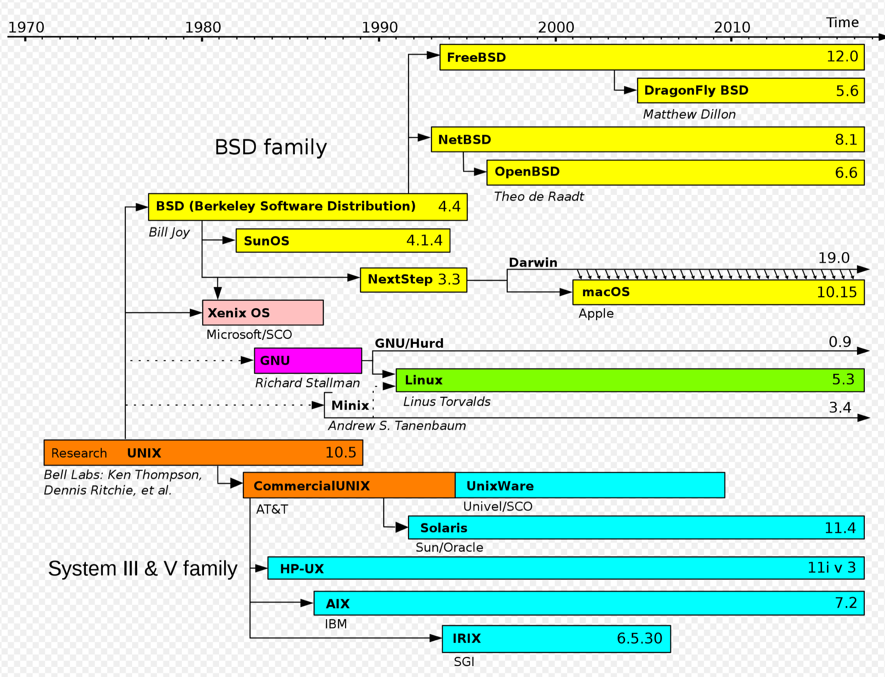
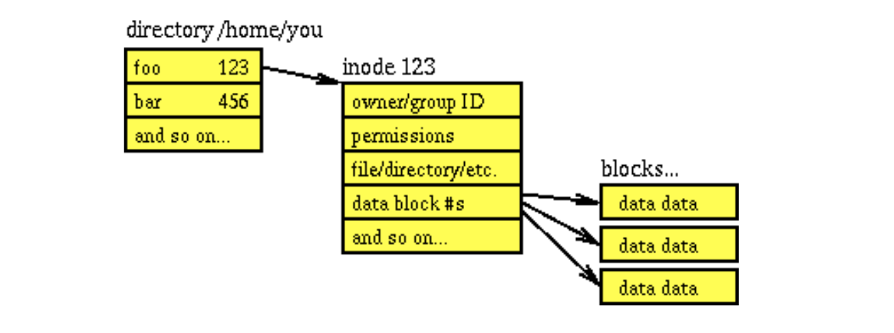
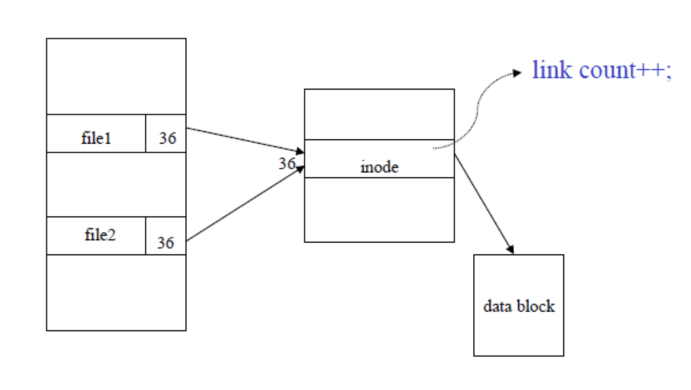
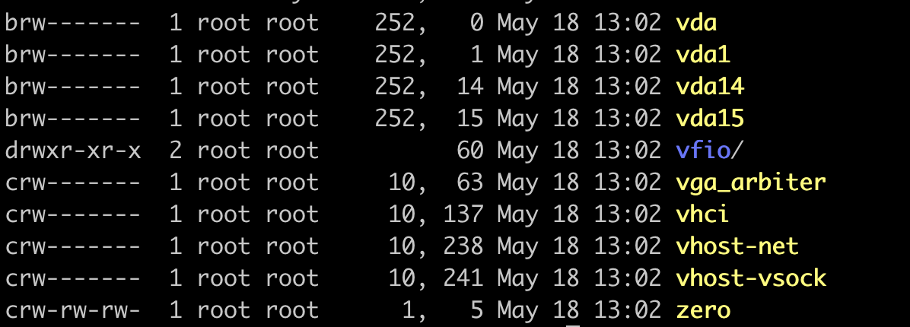

# Chp1 핵심 개념 소개
## 시스템 프로그래밍
- 시스템 프로그램 : 커널 및 시스템 라이브러리 사용
- 애플리케이션 프로그램 : 고급 라이브러리 (하드웨어와 운영체제에 대한 내용 추상화)

### 시스템 프로그래밍을 배워야 하는 이유
- 시스템 프로그래밍을 이해해야 작성하는 코드가 작동하는 레벨과 관계없이 더 나은 성능을 이끌어낼 수 있음

### 시스템 프로그래밍의 주춧돌
- System Call
- C Library
- C Compiler

### System Call
- OS에 리소스나 서비스를 요청하려고 사용자 영역에서 시작해서 커널 내부로 들어가는 함수 호출
- 보안과 안정성의 이유로 애플리케이션은 커널 코드, 내부를 직접 실행, 조작할 수 없다.
- 대신 System Call을 실행하려 한다는 '시그널'을 커널로 보낼 수 있다.
- 이 매커니즘을 통해서만 커널 내부 진입 및 커널이 허용한 코드를 실행할 수 있다.
- 시스템 콜의 유형
	- 프로세스 제어
		- 프로세스 생성, 종료
	- 파일 조작
		- 파일 생성, 삭제
	- 장치 관리
		- 장치 요청(Request devices), 장치 해제(Release device)
	- 정보 유지
		- 시간과 날짜의 설정과 획득
	- 통신
		- 통신 연결의 생성, 제거
	- 보호
		- 파일 퍼미션 획득, 설정

## API와 ABI
### API (Application Programming Interface)
소프트웨어의 소스 코드 레벨에서 서로 인터페이스 하는 방식을 정의
- 상위 레벨의 소프트웨어에서 더 하위 레벨의 소프트웨어를 호출할 수 있다.
- API를 흔히 계약이라고 부르는데, API 사용자와 API 구현체 모두 API를 준수해야 동작한다.
- 상위 레벨의 소프트웨어인 API 사용자는 구현에 직접적인 영향을 줄 수 없다. 사용하거나 사용하지 않거나 둘 중 하나이다.
### ABI (Application Binary Interface)
API는 소스 코드 수준의 인터페이스를 정의. ABI는 특정 아키텍처 간에서 동작하는 소프트웨어 간의 바이너리 인터페이스를 정의.
API가 어떤 순서로 함수에 인자값을 전달할 지에 대해 명시하고 있다면,
ABI는 이런 인자값이 어떻게 레지스터, 스택 등에 전달 될지를 정의한다고 볼 수 있다.
어떻게 코드가 라이브러리 파일 안에 저장되어 있는지를 정의하여, 해당 라이브러리를 사용하는 프로그램이 원하는 함수의 위치를 찾을 수 있도록 한다.
- 윈도우와 리눅스는 ABI가 서로 다르기 때문에, 윈도우는 리눅스용으로 컴파일 된 라이브러리에 접근할 수 없다.
- 만약 특정 라이브러리 A가 사용중일 때, A' 업데이트 되면 ABI가 유지되면 전체를 다시 컴파일 하지 않아도 된다. (Binary Compatible 하다.)  같은 저수준 인터페이스를 갖고 있음
- ABI가 바뀌었는데, API는 동일할 수 있다. (Source compatible 하다.)
- ABI 변경을 없게 하려면
	- 함수 인터페이스를 바꾸면 안된다.
		- 리턴타입, 매개변수 수, 타입
		- 자료형 정의, 구조체 정의, 상수 정의
		- 새 함수나 자료형이 추가되는 것은 가능
- ABI는 언어에 의존적이지 않다.
	- C, Pascal 컴파일 되면 같은 ABI를 사용한다.

## 표준
### 유닉스 / 리눅스 계보
- [1964] MIT, GE, Bell 연구소에서 MULTICS(Multiplexed Information and Computing Service) 를 개발하는 프로젝트를 진행하였다.
- Multics는  GE-645 메인프레임에서 동작하는 time-sharing을 지원하는 OS로 개발이 진행되었으나, 규모와 복잡성 때문에 만만치 않았다.
- [1969] 이후 Ken Thompson, Dennis Ritchie가 심플한 운영체제 개발을 제안하였고 Multics에 따온 "Unics" 가 붙여졌다. 이후 UNIX로 불리게 되었다.
- [1971] AT&T는 UNIX가 운영체제의 완성도를 갖춘 것으로 판단하고 Version 1을 발표
- [1976] Version 6 공개. 낮은 가격으로 대학에 라이센스 제공
- [1979] Version 7 공개
- [1979] AT&T에서 상대적으로 저렴한 UNIX의 서브 라이센싱을 허용하여, AIX, HP-UX, SunOS, Xenix 등이 개발됨.
- 이러한 시스템 간의 비호환은 향후 POSIX, SUS(Single Unix Specification) 표준의 토대가 됨.
- AT&T는 UNIX 전문 조직을 만들었음. USL (Unix System Laboratories)
- [1983] Version 7의 이후 버전으로 볼 수 있는 SystemV 공개
- [1990] SystemV Release4 공개. 줄여서 SVR4로 표기

- Version 6는 낮은 가격으로 대학에 배포되었고,  캘리포니아 주립대(University of California at Berkeley) 방문중이던 Ken Thompson과  대학원생 Bill Joy가 Version 6를 확장하여 BSD(Berkeley Software Distribution) UNIX로 공개
- Version 6 기능을 확장하여, C쉘, vi 에디터, TCP/IP 네트워크 관련 기능등이 추가 됨.
- [1983] 4.2 BSD 공개
- 제품으로 판매되는 System V(유료), 교육 및 연구기관 사용 BSD(무료) 두 개의 큰 흐름으로 나눠짐.
- 향후 BSD는 남아있는 기존 AT&T 코드를 모두 걷어냄.

- [1985] Richard Stallman이 GNU(GNU is Not Unix) 선언문을 발표. 이후 FSF(Free Software Foundation) 설립.
- 시스템의 대부분을 완성했지만 커널을 완성하지 못했음. 
- Linus Torvalds가 교육용 유닉스인 미닉스를 사용하다가 리눅스라는 커널을 만들어 GNU GPL 라이센스로 공개.

### POSIX와 SUS 표준 이야기
1980년대 중반 IEEE에서 표준화를 시작함. POSIX (Portable Operating System Interface) 표준 이름은 FSF의 Richard Stallman이 제안한 것
- IEEE Std 1003.1 - 1998 (POSIX 1988)
- IEEE Std 1003.1 - 1990 (POSIX 1990)
- IEEE Std 1003.1b - 1993 (POSIX 1993 또는 POSIX.1b)
- IEEE Std 1003.1c - 1995 (POSIX 1995 또는 POSIX.1c)
- IEEE Std 1003.1 - 2001 (POSIX 2001) : POSIX 1990 을 바탕으로 실시간과 스레드에 대한 표준을 모두 포함
- IEEE Std 1003.1 - 2008 (POSIX 2008) : 당시 가장 최근
- IEEE Std 1003.1 - 2017

유닉스 시스템 업체들은 서로 자신의 유닉스 변종을 표준 유닉스 운영체제로 정의하고자 노력.
몇 대형 업체가 OSF과 X/Open을 합쳐 오픈 그룹이라는 컨소시엄 구성. 
오픈 그룹은 SUS(Single Unix Specification)를 1990년대 초반에 발표.
SUS는 POSIX 표준에 비해 비용이 저렴(무료) 빠르게 인기를 얻음.
오늘날 SUS는 최신 POSIX 표준을 포함.
- SUS : 1994년 최초 버전 발표
- SUSv2 : 1997
- SUSv3 : 2002
- SUSv4 : 2008 발표. IEEE Std 1003.1 - 2008과 다른 몇 가지 표준안을 포함하고 있음.
- SUSv4-2018 : 2018

### 리눅스와 표준
리눅스는 POSIX와 SUS호환을 지향. 리눅스는 POSIX.1과 SUSv3를 따르지만, 공식적으로 인증을 마친 배포판이 없어 공식적으로  POSIX와 SUS 호환이라 말하긴 어려움.
리눅스 커널은 시스템 콜의 안정성을 보장한다. 시스템 콜이 한 번 구현이 되면 돌에 새긴 글씨처럼 견고하게 유지된다.

## 리눅스 프로그래밍의 개념
### 파일과 파일 시스템
- 파일은 리눅스에서 가장 기본적이고 핵심이 되는 추상화 개념.
- 리눅스에선 모든 것이 파일이라는 철학을 따른다.
- 파일을 접근하려면 우선 열어야하고, 열린 파일의 메타 데이터는 파일 디스크립터로 불린다.
#### 일반파일
우리가 흔히 부르는 파일이 일반 파일.
바이트 스트림으로 불리는 연속적으로 나열된 바이트 배열에 저장 된 데이터.
파일을 위한 특별한 자료 구조는 없으며, 이 데이터에는 어떤 값이라도 들어갈 수 있음. 어떤 자료구조로 저장해도 상관없음.
파일을 열면 커널에서 파일 오프셋을 열린 파일마다 메타데이터에 유지한다. 
lsof 명령어로 열린 파일 목록을 확인할 수 있다.
파일은 하나의 프로세스 또는 서로 다른 프로세스에서 한번 이상 열 수 있다. 동시 접근 시 예측 할 수 없는 결과가 발생 되므로, 신경써야한다.
- 파일은 파일 이름과 연결되어 있지 않고 inode로 불리는 고유 정수 값으로 참조된다. 
- inode는 변경된 날짜, 소유자, 타입, 길이, 데이터 저장 위치 같은 메타 정보를 갖고 있지만 파일 이름은 저장하지 않는다.
- 파일이 생성 되면 inode가 만들어지고 해당 inode는 inumber로 구분된다. inode의 목록은 i-list에 등록되어 관리된다. 

#### 디렉터리와 링크
- 파일 이름은 Directory에 inode 와 함께 매칭되어 관리된다.
- 디렉토리도 파일과 마찬가지로 inode가 있다.
#### 하드링크
동일한 inode에 대해 여러 가지 이름을 맵핑하는 것을 하드링크라 한다.
다른 하나의 파일이 삭제되어도 나머지 파일 한 개는 영향받지 않는다.
다른 파일 시스템에는 생성할 수 없다.
링크가 여러 개 존재하는 파일을 삭제할 때 시스템은 링크 수를 inode에 기록하고 있어서 링크 카운트가 0일 때만 파일을 삭제할 수 있도록 하고 있다.

#### 심볼릭 링크
다른 파일 시스템에도 생성할 수 있으며, 바로가기와 비슷한 개념이다.
별도의 inode를 생성하고 이것이 원본 파일을 가르키는 포인터를 가진다.

#### 특수파일
- 파일로 표현되는 커널 객체  (모든 것이 파일)

디바이스는 블록 디바이스와 캐릭터 디바이스로 구분 됨.
/dev 폴더에서 c로 표기되는 것이 캐릭터 디바이스, b로 표기되는 것이 블록 디바이스	

	- 블록 디바이스 파일
		- 바이트 배열로 접근. 블록이나 섹터 단위로 데이터 전송 . ex) 저장 장치
	- 캐릭터 디바이스 파일
		- 바이트로 구성된 선형 큐처럼 접근 . 읽을 문자가 남아있지 않으면 EOF 반환. ex) 키보드
	- 네임드 파이프
		- 파이프라 하면 일반적으로 익명 파이프를 뜻함. 익명 파이프는 부모 - 자식 프로세스 간 통신에 사용된다.
		- 네임드 파이프는 FIFO라는 특수한 파일을 거쳐 접근. 서로 무관한 프로세스끼리 이 파일에 접근하여 통신 가능.
		- mkfifo() 시스템 콜을 통해 생성
	- 소켓
		- 대부분의 IPC 방법들이 같은 머신 내에서 서로 다른 프로세스 간 통신에 사용되는 반면
		- 소켓은 다른 머신에 있는 프로세스 간 통신도 가능하다.
		- 소켓은 다양한 변종이 존재하며, 유닉스 도메인 소켓은 로컬 머신 내 서로 다른 프로세스 통신에 사용된다.

#### 파일시스템과 네임스페이스
- 파일 시스템
	- 파일을 쉽게 접근할 수 있도록 보관 또는 조직하는 체계
- 네임스페이스
	- 기본적으로 모든 사용자, 모든 프로세스가 공유하는 단일 네임스페이스만 존재
	- 네임스페이스 종류
		- UTS(Unix Time Sharing) : Hostname 
		- IPC : 프로세스간 통신 격리
		- PID : Process ID 분할 관리
		- Mount : File System의 mount 지점 분할 관리
		- NET : Network 리소스 분할
		- USER : user, group 분할
		- cgroup : control group 분리 (4.6 커널, 2016.03 릴리즈)
		- Time : 시스템 타임 분리 (5.6 커널, 20. 03 릴리즈)

### 프로세스
프로세스는 실행중인 프로그램을 말한다. 실행파일이 메모리에 적재될 때 프로그램은 프로세스가 된다.
- 프로세스의 메모리 배치
	- 텍스트 섹션 (실행코드)
	- 데이터 섹션 (전역 변수)
	- 힙 섹션 (동적 할당 메모리)
	- 스택 섹션 (지역변수, 함수 매겨변수 등)

- 리눅스의 일반적인 실행파일 포맷은 ELF(Executable and Linking Format)이다.
- readelf 명령어를 사용하면 ELF 내용을 확인할 수 있다.
	- ELF Header
	- ELF Section
	- Program header table (Optional)
	
#### 스레드
스레드는 CPU 이용의 기본 단위이다. 
- 스레드 구성
	- 스레드 ID
	- 프로그램 카운터
	- 레지스터 집합
	- 스택
- 코드, 데이터, 힙 영역을 동일 프로세스 내 스레드 끼리 공유한다.
- 각 프로세스는 실행 스레드를 하나 이상 포함한다.

#### 프로세스 계층 구조
- 각 프로세스는 pid로 구분됨. 
- init 프로세스가 루트
- => 자식 프로세스가 종료될 때 부모 프로세스가 상태를 검사. (종료된 프로세스를 기다린다.)
- 자식 프로세스가 종료되었는데, 부모 프로세스가 없다면, 이 때 좀비 프로세스가 된다.

### 사용자와 그룹
리눅스의 권한은 사용자와 그룹 형태
- uid로 고유하게 사용자를 구분
- root의 uid는 0.  root만 프로세스의 uid를 바꿀 수 있다. 
- 자식 프로세스는 부모 프로세스의 uid를 상속받는다.
- 실제 uid 외에 유효 did, 저장 된 did, 파일시스템 uid가 있다. 

- 그룹은 gid로 구분된다.
- 실제 gid, 유효 gid, 저장된 gid, 파일시스템 gid가 있다.

### 권한
- 파일마다 소유자, 소유자 그룹, 접근비트로 구성되어 있음. => 파일의 inode에 저장되어 있음.
- 특수 파일에서는 실행 권한은 무시된다.
- 전통적인 유닉스 접근 권한 외 ACL(Access Control List) 도 지원

### 시그널
- 커널 -> 프로세스, 프로세스 -> 프로세스, 프로세스 -> 자기 자신
- Segmentation Fault 또는 Ctrl+C 같은 이벤트를 전달.
- 시그널 발생 시 기본 시그널 동작을 따르거나, 무시하거나, 새로운 동작을 하도록 만들 수 있다.
- 시그널 핸들러로 처리.

### 프로세스 간 통신
- IPC
	- 파이프 / 네임드 파이프
	- 세마포어
	- 메세지 큐
	- 공유 메모리
	- Futex(Fast Userspace muTEX)

### 에러 처리
- 특수 변수인 errno로 에러 발생 이유를 확인할 수 있다.
- 보통은 에러 발생 시 -1를 반환하는데, 여기는 이유가 충분히 담겨있지 않다. 이때 에러 변수 errno의 내용을 통해 상세 내용을 알 수 있다.
- errno는 해당 함수를 호출 한 직후에만 유효하다.
- 싱글 스레드에서는 전역변수이지만, 멀티스레드에서는 errno는 스레드별로 저장되어 사용 가능하다..